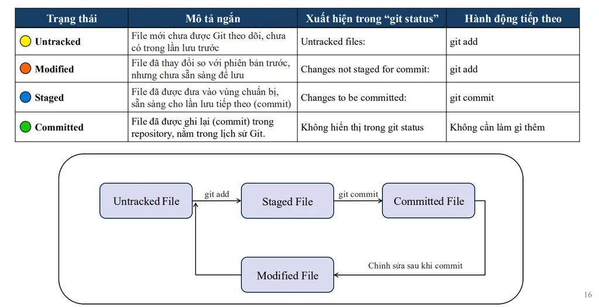

# git_learn

**Cấu hình cơ bản:**
Sau khi cài đặt, người dùng cần thiết lập thông tin người dùng và các tùy chọn cơ bản. Thông tin
này sẽ được gắn với mỗi commit người dùng thực hiện:
    - **Thiết lập tên người dùng:**
    bash git config --global user.name "Tên Của Người Dùng"
    - **Thiết lập email người dùng**: bash git config --global user.email "email@example.com"
    - **Cấu hình trình soạn thảo mặc định (ví dụ: VS Code)**: bash git config --global core.editor "code --wait"
    - **Bật màu sắc cho đầu ra Git**: bash git config --global color.ui auto

**Thiết lập Alias hữu ích:**
Alias (bí danh) giúp người dùng tạo các lệnh tắt cho các câu lệnh Git thường dùng, tiết kiệm thời
gian và công sức:
    - **git status thành git st** : bash git config --global alias.st status
    - **git checkout thành git co** : bash git config --global alias.co checkout
    - **git branch thành git br** : bash git config --global alias.br branch
    - **git commit -m thành git cm** : bash git config --global alias.cm "commit -m"

**Xem lịch sử commit:**

- git log -p : Hiển thị sự khác biệt (diff) của mỗi commit, cho người dùng thấy chính xác những dòng nào đã được thêm, sửa đổi hoặc xóa.
- git log --stat : Hiển thị số lượng tập tin và dòng đã thay đổi trong mỗi commit.
- git log --since="<thời gian>" : Lọc các commit được thực hiện trong
khoảng thời gian cụ thể (ví dụ: git log --since="2 weeks ago" ).
- git log --author="<tên_tác_giả>" : Lọc các commit theo tên của người tạo.

Ta có thể kết hợp nhiều tùy chọn để tối ưu cách xem lịch sử. Ví dụ, git log --oneline --graph --all sẽ hiển thị lịch sử commit dưới dạng đồ thị ngắn gọn cho tất cả các nhánh, rất hữu ích để hình dung cấu trúc dự án.

**Các thao tác cơ bản để theo dõi và lưu trữ thay đổi:**
- git status: xem trạng thái hiện tại của các tập tin trong thư mục làm việc của người dùng.
- git add <tên_file.txt> : Sau khi sửa đổi hoặc tạo tập tin mới, người dùng cần đưa chúng vào vùng chuẩn bị trước khi lưu trữ. Vùng chuẩn bị là nơi người dùng chọn những thay đổi cụ thể mà người dùng muốn đưa vào commit tiếp theo.
- git commit -m : Sau khi các thay đổi đã được chuẩn bị, người dùng có thể lưu trữ chúng vào lịch sử Git bằng lệnh git commit . Mỗi commit cần có một thông điệp mô tả ngắn gọn về những thay đổi đã được thực hiện. 

**Lưu ý về git reset**
- git restore <tên_file> : Khôi phục tập tin về trạng thái của commit gần nhất. Cảnh báo: Lệnh này sẽ xóa hoàn toàn các thay đổi chưa commit và không thể khôi phục!
- git restore --staged <tên_file> : Đưa tập tin từ vùng staged về trạng thái modified, cho phép người dùng sửa đổi thêm trước khi commit.
- git commit --amend: Cho phép người dùng sửa đổi thông điệp commit cuối cùng hoặc thêm/bớt các tập tin vào commit đó.
- git revert<commit-hash> : Tạo một commit mới để hoàn tác các thay đổi của commit được chỉ định. Lịch sử commit vẫn được giữ nguyên.